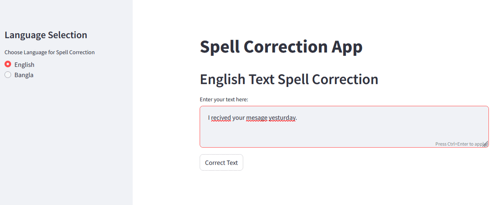

<h1 align="center">Multilanguage Spell Correction Project</h1>

<p align="center">
  
</p>

## Overview
A robust spell correction system supporting both Bangla and English languages. This project uses deep learning approaches to detect and correct spelling mistakes in text while maintaining the context and semantic meaning. Powered by state-of-the-art transformer architectures, it offers unprecedented accuracy in handling complex linguistic patterns and contextual corrections. My system intelligently adapts to different writing styles and regional variations, making it ideal for both personal and professional content editing. Whether you're writing academic papers, business documents, or casual text, this tool ensures your writing remains error-free while preserving the natural flow of language.

Built on advanced transformer architectures, the system leverages MBartForConditionalGeneration for Bangla text processing, specifically designed to handle the complexities of South Asian languages, while utilizing AutoModelForSeq2SeqLM for English text correction, ensuring high-quality results across both languages. These pre-trained models are fine-tuned on extensive language-specific datasets to achieve optimal performance in spell correction tasks.

## Features
- Dual language support (Bangla and English)
- Context-aware spell correction
- Custom training capability
- Pretrained models for quick start
- Evaluation metrics for model performance
- Separate preprocessing pipelines for each language

## Project Structure

```
Spell-correction/
│
├── Bangla_text/
│   ├── checkpoint/            # Training checkpoints
│   ├── data/                  # Training data for Bangla
│   ├── data_preprocessing.py  # Data preprocessing for Bangla
│   ├── evaluation.py          # Model evaluation
│   ├── main.py                # Main execution file
│   └── model_training.py      # Training pipeline
│
├── English_text/
│   ├── data/                  # Training data for English
│   ├── output/
│   │   └── Checkpoint1/       # Stored training checkpoints
│   ├── data_preprocessing.py  # Data preprocessing for English
│   ├── test_model.py          # Model testing
│   └── train_model.py         # Training pipeline
│
├── Output_Examples/           # Example outputs and corrections
├── app.py                     # Main application file
└── requirements.txt           # Project dependencies
```


## Prerequisites
- Python 3.8+
- PyTorch
- CUDA (optional, for GPU support)
- Hugging Face Transformers
- Additional dependencies listed in `requirements.txt`

## Installation

 ##### 1. Clone the repository:
```
git clone https://github.com/Fardins/Spell-Correction.git
cd Spell-Correction
```

##### 2. Create a virtual environment (recommended):

```
python -m venv venv
source venv/bin/activate  # On Windows: venv\Scripts\activate
```

##### 3. Install dependencies:

```
pip install -r requirements.txt
```

## Usage

#### Bangla Spell Correction
##### 1. Prepare Bangla text data:

```
cd Bangla_text
python data_preprocessing.py
```

##### 2. Train the model:

```
python model_training.py
```

##### 3. Evaluate the model:
```
python evaluation.py
```

#### English Spell Correction
##### 1. Prepare English text data:
```
cd English_text
python data_preprocessing.py
```

##### 2. Train the model:
```
python train_model.py
```

##### 3. Test the model:
```
python test_model.py
```

#### Streamlit App
Launch the interactive web application:
```
streamlit run app.py
```
My app will be available locally at: http://localhost:8501.

## Output Example
Here are some examples of given text and the resulting generated by the trained model:
- For Bangla text
<p align="center">
  
</p>

- For English text
<p align="center">
  
</p>

This project represents an evolving journey in multilingual spell correction, with continuous improvements through iterative training and fine-tuning processes. While achieving remarkable accuracy in many common scenarios, I maintain transparency about its current capabilities and limitations. My model demonstrates particularly strong performance in context-aware corrections and shows promising results with both formal and informal text styles. 

The system is designed with extensibility in mind, allowing for easy integration of new training data and regular model updates to enhance its correction capabilities further. As with any AI-powered tool, results may vary depending on input complexity and edge cases, but our commitment to ongoing refinement ensures steadily improving performance.

## Evaluation Summary

#### Bangla Spell Correction
- **BLEU (Bilingual Evaluation Understudy Score):**
  - Training: 0.805
  - Testing: 0.443
- **CER (Character Error Rate):**
  - Training: 0.053
  - Testing: 0.159
- **WER (Word Error Rate):**
  - Training: 0.101
  - Testing: 0.406
- **Meteor:**
  - Training: 0.904
  - Testing: 0.655

#### English Spell Correction
- **Training Loss:** 0.0318
- **Validation Loss:** 0.0290


### **Evaluation Summary Table**

| **Language** | **Metric**  | **Training** | **Testing/Validation** |
|--------------|-------------|--------------|-------------------------|
| Bangla       | BLEU        | **0.805**    | **0.443**              |
|              | CER         | **0.053**    | **0.159**              |
|              | WER         | **0.101**    | **0.406**              |
|              | Meteor      | **0.904**    | **0.655**              |
| English      | Loss        | **0.0318**   | **0.0290** (Validation) |

The evaluation results highlight the effectiveness of the Multilanguage Spell Correction model. For Bangla, the BLEU score of 0.805 during training indicates strong linguistic fluency, though testing at 0.443 suggests room for improvement. The low CER in training (0.053) confirms precise character-level corrections, but testing shows increased challenges (0.159). Similarly, WER and Meteor scores reinforce consistent performance, with a slight dip in testing. For English, the training loss of 0.0318 and validation loss of 0.0290 reflect a stable and well-generalized model. 

Overall, the results demonstrate solid performance across both languages, with scope for enhancing testing metrics.

## Acknowledgements

- The model training scripts and data preprocessing were adapted from various open-source resources.
- Hugging Face for providing state-of-the-art models like BERT for spell correction tasks.

## Author
##### Md Atickur Rahman: atickft13129@gmail.com 
##### Github: [Github](https://github.com/Fardins)